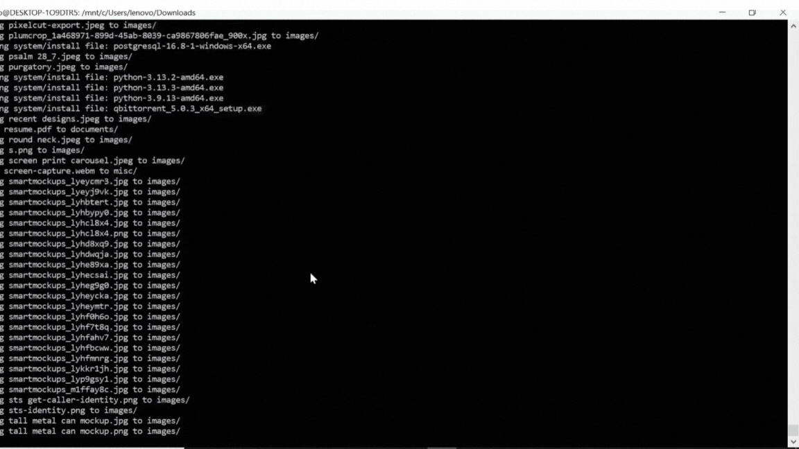
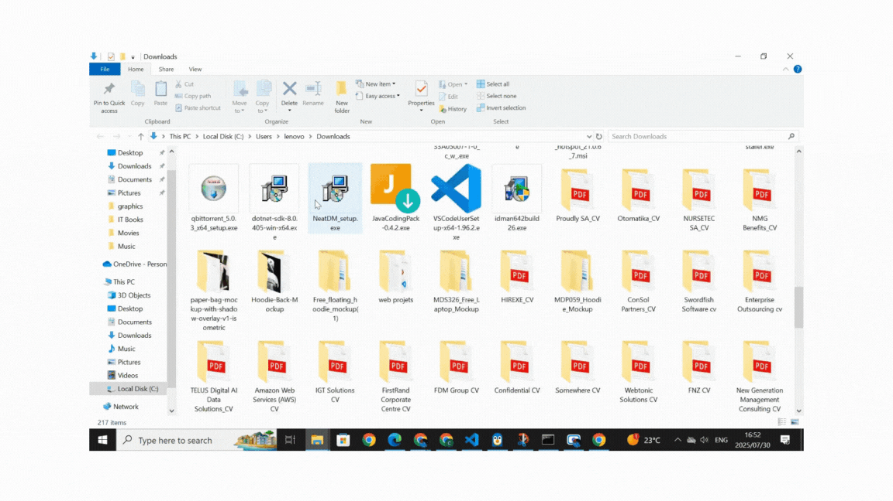

#  Folder Organizer Bash Script

This is a Bash script that automatically organizes a cluttered folder (like Downloads) by sorting files into subfolders based on type — images, documents, videos, and more.

---

##  Problem
Most people's Downloads folders quickly become a mess of mixed file types. Manually sorting them is time-consuming and annoying.

---

##  Solution
This Bash script automatically:
- Detects file types
- Creates subfolders (`images/`, `documents/`, etc.)
- Moves files into the correct folder

---

##  Demo

###  Before:
```
Downloads/
├── file.jpg
├── resume.pdf
├── archive.zip
└── [messy files everywhere]
```

###  Script Running:


###  After:


```
Downloads/
├── images/
│   └── file.jpg
├── documents/
│   └── resume.pdf
├── archives/
│   └── archive.zip
└── [everything organized!]
```

---

##  How It Works

The script:
1. Takes a folder path as input (defaults to `Downloads`)
2. Creates subfolders like `images/`, `documents/`, `videos/`, `archives/`
3. Moves files based on their extensions

### Example Mappings
| File Extension       | Moved To Folder |
|----------------------|-----------------|
| `.jpg`, `.png`       | `images/`       |
| `.pdf`, `.docx`      | `documents/`    |
| `.mp4`, `.mkv`       | `videos/`       |
| `.zip`, `.rar`       | `archives/`     |
| Other file types     | `others/`       |

---

##  Usage

### 1. Clone this repo
```bash
git clone https://github.com/CharlesMCMaponya/folder-organizer.git
cd folder-organizer
```

### 2. Make script executable
```bash
chmod +x organize.sh
```

### 3. Run it
```bash
bash organize.sh
```

It will organize your Downloads folder by default. You can change the folder path in the script.

---

## Why I Built This

I created this tool to solve a real problem: my messy Downloads folder. It also helped me practice Bash scripting, file handling, and GitHub project structure — while making my desktop cleaner and more productive.

---

##  Project Structure
```
folder-organizer/
├── organize.sh           # Main script
├── README.md            # Project info
└── demo/
    ├── terminal-demo.gif    # Terminal running
    └── organized-demo.gif   # Files organized
```

---

##  Author
**Charles Mosehla Maponya**